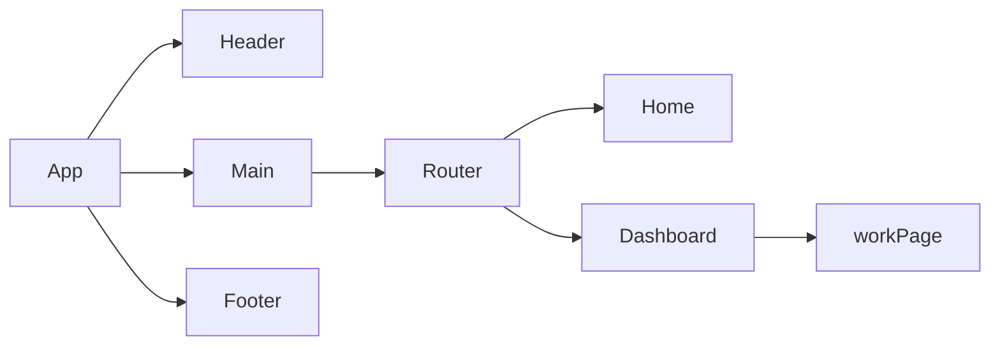

# Product Requirements Documentation

**Summary**

| Field         | Detail                                                                                           |
| ------------- | ------------------------------------------------------------------------------------------------ |
| Project Name  | OpusManifest                                                                                     |
| Description   | A database where composers can enter their compositions' details and show their catalog of works |
| Developers    | Hojoon Kim                                                                                       |
| Repo-back     | https://github.com/hojoon0724/opusManifest-back                                                  |
| Repo-front    | https://github.com/hojoon0724/opusManifest-front                                                 |
| Live Backend  | https://opusmanifest-back.onrender.com                                                           |
| Live Frontend |                                                                                                  |

## Problem Being Solved and Target Market

Composers struggle to keep track of their works and showcase them effectively on their websites. This app simplifies this process, providing a straightforward solution for composers to organize their catalog and seamlessly display it online.

## User Stories

- Users should be able to see the site on desktop and mobile
- Users can create a new entry
- Users can see all their works on the dashboard
- Users can see a detail page of selected work
- Users can update the work
- Users can delete the work

## Backend Server

https://opusmanifest-back.onrender.com/

## Component Architecture

## User Interface Mockups

