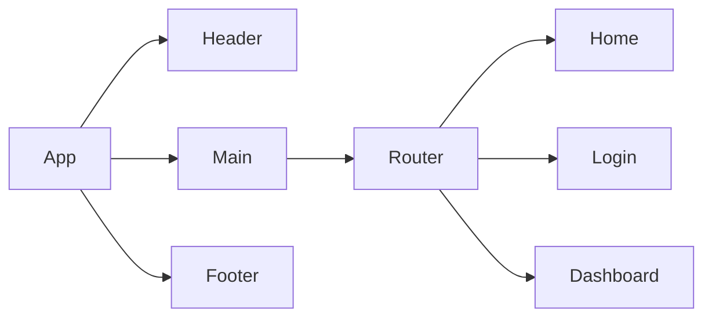

A PRD (Product Requirements Document) is created before creating a product or feature and includes the planning required for developers to execute effectively. This document is usually prepared by Product Managers, read more [here](https://www.atlassian.com/agile/product-management/requirements)\*

# Product Requirements Documentation

**Summary**

| Field        | Detail                                                                                           |
| ------------ | ------------------------------------------------------------------------------------------------ |
| Project Name | OpusManifest                                                                                     |
| Description  | A database where composers can enter their compositions' details and show their catalog of works |
| Developers   | Hojoon Kim                                                                                       |
| Live Website |                                                                                                  |
| Repo         |                                                                                                  |

## Problem Being Solved and Target Market

Composers struggle to keep track of their works and showcase them effectively on their websites. This app simplifies this process, providing a straightforward solution for composers to organize their catalog and seamlessly display it online.

## User Stories

- Users should be able to see the site on desktop and mobile
- Users can create an account
- Users can sign in to their account
- Users can create a new item
- Users can see all their items on the dashboard
- Users can update items
- Users can delete items

## Route Tables

You should also include any additional notes on any special headers that may be used and so forth.

| Endpoint     | Method | Response                                          | Other                                          |
| ------------ | ------ | ------------------------------------------------- | ---------------------------------------------- |
| /item        | GET    | JSON of all items                                 |                                                |
| /item        | POST   | Create new item return JSON of new item           | body must include data for new item            |
| /item/:id    | GET    | JSON of item with matching id number              |                                                |
| /item/:id    | PUT    | update item with matching idea, return its JSON   | body must include updated data                 |
| /item/:id    | DELETE | delete the item with the matching id              |                                                |
| /auth/signup | POST   | creates new user account returns user JSON        | new user info must be included in body         |
| /auth/login  | POST   | logs in user and returns user JSON with JWT token | username and password must be included in body |

## Component Architecture

You can use the [Mermaid Markdown Syntax](https://mermaid-js.github.io/mermaid/#/flowchart) to create a chart of how the parts of your frontend website relate to each other. Units should represent components of your page. The following is an example you may see in a Single Page Application like a React App.

## User Interface Mockups
